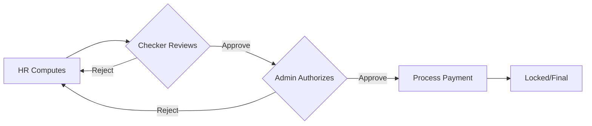

# StaffWise HRMS

<p align="center">
  
  
  
  
</p>

**StaffWise** is a comprehensive Role-Based Human Resource Management System (HRMS) platform designed to streamline HR operations, payroll processing, and employee management for organizations of all sizes.

## 🚀 Features

### Role-Based Access Control
The system supports five distinct roles with specific permissions:

| Role | Capabilities |
|------|-------------|
| **System Admin** | Full access to all features, user management, system configuration |
| **HR** | Employee management, leave approval, attendance tracking, payroll computation |
| **Payroll Checker** | Review and verify computed payroll, approve or reject with remarks |
| **Payroll Admin** | Authorize verified payroll, process payments, final approval |
| **Employee** | View profile, check-in/out, request leaves, view payslips |

### Core Modules

#### 👤 Employee Self-Service
- Personal profile management
- Attendance check-in/check-out
- Leave balance tracking
- Leave, overtime, and late-coming request submission
- Payslip viewing and download (PDF)

#### 👥 HR Management
- Employee onboarding and management
- Attendance tracking and correction
- Leave request approval/rejection
- Payroll computation with automatic calculations
- Department management

#### 💰 Payroll Processing (4-Eye Principle)
The payroll follows a secure multi-step approval workflow:

1. **Compute** (HR) → Status: `COMPUTED`
2. **Check** (Payroll Checker) → Status: `CHECKED`
3. **Authorize** (Payroll Admin) → Status: `AUTHORIZED`
4. **Process** (Payroll Admin) → Status: `PROCESSED` (Locked)

#### 📊 Dashboard & Analytics
- Role-specific dashboards
- Key metrics and statistics
- Pending requests overview
- Recent payroll runs

## 🛡️ Security Features

### Authentication & Authorization
- JWT-based authentication with refresh tokens
- Role-based access control (RBAC)
- Password encryption using AES-256-CBC
- Secure token storage and management

### Rate Limiting
- Login attempt tracking by IP and email
- Maximum 5 failed attempts before lockout
- 15-minute lockout duration
- Protection against brute force attacks

### Audit Trail
- All actions are logged with timestamps
- User activity tracking
- Payroll workflow audit trail

## 🏗️ Architecture

### Backend (Spring Boot)
```
backend/
├── src/main/java/com/staffwise/hrms/
│   ├── config/          # Security, CORS, Data initialization
│   ├── controller/      # REST API endpoints
│   ├── dto/             # Data Transfer Objects
│   ├── entity/          # JPA Entities
│   ├── exception/       # Custom exceptions & handlers
│   ├── repository/      # JPA Repositories
│   ├── security/        # JWT, Authentication filters
│   ├── service/         # Business logic
│   └── util/            # Utility classes
└── src/test/            # Integration tests
```

### Frontend (Angular)
```
frontend/
├── src/app/
│   ├── core/            # Services, guards, interceptors, models
│   ├── features/        # Feature modules (auth, employee, hr, payroll, admin)
│   ├── shared/          # Shared components
│   └── layout/          # Layout components
└── src/environments/    # Environment configuration
```

## 🚦 Getting Started

### Prerequisites
- Java 17+
- Node.js 18+
- MySQL 8.0+
- Maven 3.8+

### Backend Setup

1. **Configure Database**
   ```yaml
   # backend/src/main/resources/application.yml
   spring:
     datasource:
       url: jdbc:mysql://127.0.0.1:3306/staffwise
       username: root
       password: your_password
   ```

2. **Run Backend**
   ```bash
   cd backend
   mvn spring-boot:run
   ```
   The API will be available at `http://localhost:8080`

### Frontend Setup

1. **Install Dependencies**
   ```bash
   cd frontend
   npm install
   ```

2. **Run Development Server**
   ```bash
   npm start
   ```
   The app will be available at `http://localhost:4200`

## 👥 Demo Accounts

| Role | Email | Password |
|------|-------|----------|
| System Admin | admin@staffwise.com | Admin@123 |
| HR | hr@staffwise.com | Hr@123456 |
| Payroll Checker | checker@staffwise.com | Checker@123 |
| Payroll Admin | payrolladmin@staffwise.com | PayrollAdmin@123 |
| Employee | john.doe@staffwise.com | Employee@123 |

## 🧪 Testing

### Running Backend Tests
```bash
cd backend
mvn test
```

### Test Coverage
The test suite includes:
- **AuthController Tests**: Login, token refresh, logout, rate limiting
- **EmployeeController Tests**: Profile, attendance, leave requests, payslips
- **HRController Tests**: Employee management, leave approval, payroll computation
- **PayrollController Tests**: Check, authorize, process workflow

## 📋 API Endpoints

### Authentication
| Method | Endpoint | Description |
|--------|----------|-------------|
| POST | `/api/auth/login` | User login |
| POST | `/api/auth/refresh` | Refresh token |
| POST | `/api/auth/logout` | User logout |

### Employee Self-Service
| Method | Endpoint | Description |
|--------|----------|-------------|
| GET | `/api/employee/profile` | Get profile |
| PUT | `/api/employee/profile` | Update profile |
| POST | `/api/employee/attendance/checkin` | Check in |
| POST | `/api/employee/attendance/checkout` | Check out |
| GET | `/api/employee/leaves/balance` | Get leave balances |
| POST | `/api/employee/requests/leave` | Submit leave request |
| GET | `/api/employee/payslip/my` | Get payslips |

### HR Management
| Method | Endpoint | Description |
|--------|----------|-------------|
| GET | `/api/hr/employees` | List employees |
| POST | `/api/hr/employees` | Create employee |
| PUT | `/api/hr/employees/{id}` | Update employee |
| POST | `/api/hr/requests/{id}/approve` | Approve request |
| POST | `/api/hr/payroll/compute` | Compute payroll |

### Payroll Workflow
| Method | Endpoint | Description |
|--------|----------|-------------|
| GET | `/api/payroll/check/pending` | Pending for check |
| POST | `/api/payroll/check/approve` | Approve check |
| GET | `/api/payroll/authorize/pending` | Pending authorization |
| POST | `/api/payroll/authorize/approve` | Authorize payroll |
| POST | `/api/payroll/process/execute` | Process payment |

## 🔄 Payroll Workflow



## 📝 Payroll Calculations

### Earnings
- **Basic Salary**: As defined for employee
- **HRA**: 40% of basic salary
- **Transport Allowance**: ₹1,600
- **Medical Allowance**: ₹1,250
- **Special Allowance**: 10% of basic salary
- **Overtime Pay**: Based on approved overtime hours

### Deductions
- **PF**: 12% of basic salary
- **TDS**: 5-10% based on gross salary
- **Leave Without Pay**: Proportional deduction
- **Late Deductions**: Based on late count

## 🔐 Security Considerations

### Password Requirements
- Minimum 6 characters
- Encrypted during transmission (AES-256-CBC)
- Stored using BCrypt hashing

### Session Management
- JWT tokens expire after 24 hours
- Refresh tokens valid for 7 days
- Secure HTTP-only cookie support ready

### Rate Limiting
```
Max Attempts: 5
Lockout Duration: 15 minutes
Tracked by: IP address and email
```

## 🛠️ Built With

### Backend
- **Spring Boot 3.2** - Application framework
- **Spring Security** - Authentication & authorization
- **Spring Data JPA** - Database access
- **MySQL** - Database
- **JWT (jjwt)** - Token-based authentication
- **Lombok** - Reduce boilerplate code
- **MapStruct** - Object mapping
- **iText 7** - PDF generation

### Frontend
- **Angular 18** - Frontend framework
- **Angular Signals** - State management
- **SCSS** - Styling
- **Material Icons** - Icon library

## 📄 License

This project is licensed under the MIT License.

## 🤝 Contributing

1. Fork the repository
2. Create a feature branch (`git checkout -b feature/amazing-feature`)
3. Commit your changes (`git commit -m 'Add amazing feature'`)
4. Push to the branch (`git push origin feature/amazing-feature`)
5. Open a Pull Request

## 📞 Support

For support, please open an issue in the GitHub repository.

---

<p align="center">
  Made with ❤️ by the StaffWise Team
</p>
